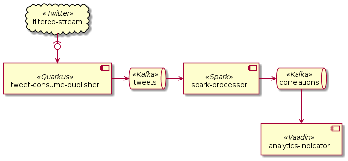

# social-weather-streamer

This project aimed to create a combined flow of data from Twitter and open weather information.
The tweets text was then supposed to be analyzed by using the machine learning framework [ johnsnowlabs ]( https://johnsnowlabs.com ),
which have a pretrained model just for analyzing tweets sentiment.
This data was supposed to be matched with the temperature of the geolocation attached to the tweets,
data which we filtered out in our first step of gathering the tweets as seen below:

## Twitter Stream

We applied for developer accounts over at [Twitter](https://twitter.com), which enabled us to use their API to query for tweets.
This is done in the [ tweet-consume-publisher ](./tweet-consume-publisher/README.md)-module which describes how to get that part running.
These tweets are then published to a Kafka topic, tweets, if they have geolocation.
This feed rolls at about one tweet with geolocation per 5 seconds.
It is not super fast, but it is realistic data.

## Weather API

Now that we have a Kafka topic of tweets with geolocation, we consume the tweets topic in [weather-enricher](./weather-enricher/README.md)-module.
For it, we used [weatherapi.com](https://www.weatherapi.com/), from which a free account nets you 1 million weather requests per month,
more than enough to keep up with the Twitter feed.
See the [weather-enricher readme](./weather-enricher/README.md) for how to get that API token into the application.
These enriched tweets were then sent off to the Kafka topic `tweets-enriched`.

## Spark Processor

Next was the hardest part:
Machine Learning.
Started off the same way as previously, consume from Kafka topic `tweets-enriched` and setup a Kafka producer, but in Spark this time.
While we though that this would be straight forward, our lack of machine learning experience was crystal clear.
The documentation [sometimes led us to believe it would be very easy](https://nlp.johnsnowlabs.com/2021/01/18/analyze_sentimentdl_use_twitter_en.html),
but that was not the case.
Instead, we opted for a random variable, which is not [much worse than the library](https://github.com/felix-seifert/social-weather-streamer/pull/11).
After having used the random variable just as we would have the [ "correct" sentiment ](https://nlp.johnsnowlabs.com/2021/01/18/sentimentdl_use_twitter_en.html#benchmarking)
and loosing 30% accuracy, we once again produced to a new Kafka topic, `correlations`.

## Front-end

The bane of our existence, things look good when they are pretty.

