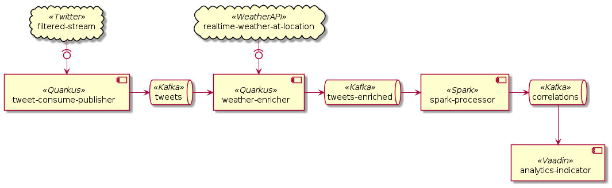

# social-weather-streamer

This project aims to show a correlation between the sentiment of a Tweet from Twitter and the local
weather at the time of tweeting. The service retrieves Tweets
from [Filtered Stream](https://developer.twitter.com/en/docs/twitter-api/tweets/filtered-stream)
API, checks whether they have a location associated, enriches them with weather and analyses their
sentiment. Eventually, the sentiment average will be displayed on a simple webpage.

The following picture describes the architecture of the whole system. The following sections
describe the different project components in more details.

## Infrastructure

As seen above, there are a bunch of things going on in this project. To ease the management of some
of it, there is a `docker-compose.yml` in the [Infrastructure](./infrastructure) folder. It manages
starting up Docker containers of Kafka and ZooKeeper. The folder also include a script to set up the
expected Kafka topics. See the [infrastructure README](./infrastructure/README.md) for more
information.

## Twitter Stream

We applied for a developer accounts at [Twitter](https://twitter.com), which enabled us to use their
API to query Tweets. Retrieving only Tweets with locations is limited to researcher. Even though
Twitter states that Master's students can also receive researcher access, Twitter did not want to
accept us. We worked around this issue by implementing the service
[tweet-consume-publisher_](./tweet-consume-publisher). This service basically pulls Tweets about a
few mayor cities and publishes the Tweets which have a geolocation to the topic `tweets`.

## Weather API

We consume the topic `tweets` in the module [weather-enricher](./weather-enricher) to enrich the
Tweets which have a geolocation with weather data. We
use [weatherapi.com](https://www.weatherapi.com/) where a free account nets you 1 million weather
requests per month, more than enough to keep up with the Twitter feed. See
the [README](./weather-enricher/README.md) to know how to get the needed API token into the
application. These enriched Tweets are then sent off to the Kafka topic `tweets-enriched`.

## Spark Processor

Processing the data in Spark starts off the same way as previously: subscribe to the Kafka
topic `tweets-enriched`
and set up a Kafka producer. A Tweet's text was then supposed to be analyzed by using the machine
learning framework from [ johnsnowlabs ]( https://johnsnowlabs.com ), which has a pretrained model
just for analyzing Tweet sentiment. This data was supposed to be matched with the temperature of the
geolocation attached to the Tweets. The
documentation [sometimes led us to believe that it would be very easy](https://nlp.johnsnowlabs.com/2021/01/18/analyze_sentimentdl_use_twitter_en.html)
but our lack of Machine Learning knowledge proved us otherwise.

Instead, we opted for a random variable, which is
not [much worse than the library](https://github.com/felix-seifert/social-weather-streamer/pull/11).
We treat the random sentiment value as
the ["correct" sentiment](https://nlp.johnsnowlabs.com/2021/01/18/sentimentdl_use_twitter_en.html#benchmarking)
and accept loosing 30% accuracy. We publish the results to the Kafka topic `correlations`.

## Frontend

The bane of our existence, things look good when they are pretty. We therefore show the results on a
webpage. The frontend module in [analytics-indicator](./analytics-indicator) subscribes to the
topic `correlations` and from then on, it calculates the average value of all the correlations. The
correlation value ranges from `-1` for an anti-correlation to `1` for a correlation. To reload the
current correlation value, just press the button of the correlation value.

## Run Whole System

1. Prepare the [infrastructure](./infrastructure) including the creation of the Kafka topics and the
   local installation of Apache Spark.
2. Start the [frontend application](./analytics-indicator).
3. Start the [spark-processor](./spark-processor).
4. Start the [weather-enricher](./weather-enricher).
5. Start the [tweet-consume-publisher](./tweet-consume-publisher).
6. See and update the result on [`http://localhost:8080`](http://localhost:8080).

At the beginning, the Twitter API does not return so many Tweets. After a few minutes, however, the
current rule set results in around one Tweet with a geolocation every five seconds.